  

 

## Hey, I'm Silly Goose 👋

I work at the intersection of **AI**, **marketing** and **personal branding**.

I build agentic AI systems that do real work, run ad-tech that ties marketing spend to outcomes, and help founders and creators build brands that hold up under scrutiny. Most of my work ships — this profile is the receipts.

## Work

### AI & Agents

- [DOT](https://github.com/Silly-Goose-duh/DOT)
- [echo](https://github.com/Silly-Goose-duh/echo)
- [agent-vault](https://github.com/Silly-Goose-duh/agent-vault)
- [Refro](https://github.com/Silly-Goose-duh/Refro)

### Marketing & Ad-Tech

- [NeuroAd](https://github.com/Silly-Goose-duh/NeuroAd-frontend)
- [neuro.ad](https://github.com/Silly-Goose-duh/neuroad)
- [CampusPass](https://github.com/Silly-Goose-duh/MakeYourPass)

### Brand & Client

- [Sharon Weds Amala](https://github.com/Silly-Goose-duh/sharon-weds-amala)

## 🛠 Stack

**AI:** LLM agent design, prompt architecture, agent memory, DeepSeek Harness
**Languages:** TypeScript, Python, Kotlin, JavaScript, C++, HTML, CSS
**Frontend:** React 19, Next.js, Vite, Tailwind CSS, Framer Motion
**Backend:** Supabase, PostgreSQL, REST APIs
**Mobile:** Kotlin, Jetpack Compose
**Deploy:** Vercel, Netlify, GitHub Pages
**Brand:** Positioning, design systems, Figma

## 🧰 More

- **[Personal Portfolio](https://github.com/Silly-Goose-duh/tomson-j-finosh-portfolio)** — [Live](https://tomson-j-finosh.vercel.app)
- **[Figma Plugin Dev Intro](https://github.com/Silly-Goose-duh/figma-plugin-dev-intro)**
- **[Blog](https://github.com/Silly-Goose-duh/Blog.github.io)**

## 📬 Contact

- Email: gooseisback4u@gmail.com
- GitHub: [github.com/Silly-Goose-duh](https://github.com/Silly-Goose-duh)

---

*Learning in public, shipping often, and building things that matter.*
